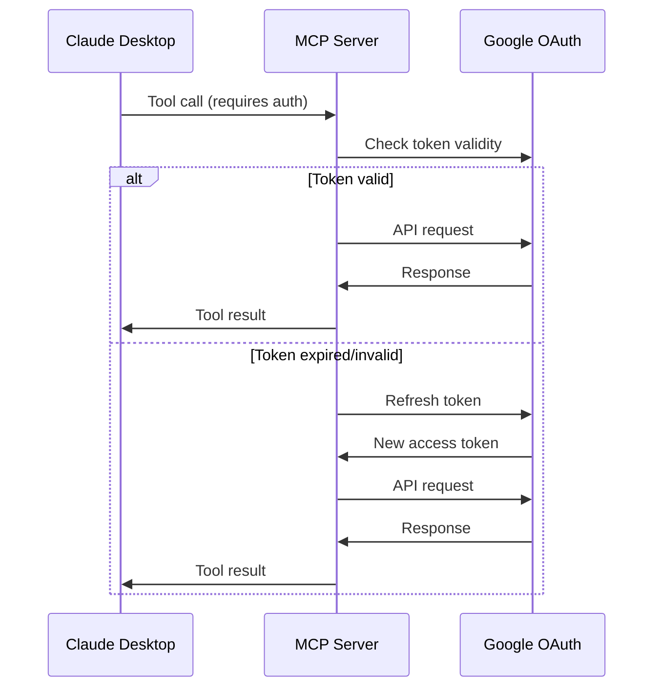

# Architecture Documentation

## Overview

This document describes the technical architecture of the Claude Desktop Extension for Google Sheets access. The extension implements the Model Context Protocol (MCP) to provide Claude Desktop with secure, authenticated access to Google Sheets data.

## System Architecture

### High-Level Architecture

```
┌─────────────────┐    ┌──────────────────┐    ┌─────────────────┐
│   Claude        │    │   MCP Server     │    │   Google        │
│   Desktop       │◄──►│   (Extension)    │◄──►│   Sheets API    │
│                 │    │                  │    │                 │
└─────────────────┘    └──────────────────┘    └─────────────────┘
                              │
                              ▼
                       ┌──────────────────┐
                       │   OAuth2         │
                       │   Authentication │
                       └──────────────────┘
```

### Component Breakdown

#### 1. Claude Desktop Integration
- **Interface**: MCP Protocol over stdio
- **Communication**: JSON-RPC messages
- **Tools**: Two main tools exposed to Claude
  - `search_googlesheets_files`
  - `get_googlesheet`

#### 2. MCP Server (Node.js)
- **Entry Point**: `server/index.js`
- **Protocol**: Implements MCP specification
- **Authentication**: OAuth2 flow management
- **API Integration**: Google Sheets API client

#### 3. Google Sheets API
- **Authentication**: OAuth2 with refresh tokens
- **Scopes**: `https://www.googleapis.com/auth/spreadsheets.readonly`
- **Rate Limiting**: Respects Google API quotas
- **Error Handling**: Graceful degradation

## Design Principles

### 1. Security First [SFT]
- OAuth2 authentication for all API calls
- No persistent storage of sensitive data
- HTTPS-only communication
- Minimal permission scopes

### 2. Simplicity [SF]
- Single-purpose MCP server
- Clear separation of concerns
- Minimal dependencies
- Straightforward error handling

### 3. Reliability [REH]
- Comprehensive error handling
- Retry logic for transient failures
- Graceful degradation
- Detailed logging

## Implementation Details

### MCP Server Structure

```javascript
// server/index.js - Main entry point
class GoogleSheetsMCPServer {
  constructor() {
    this.auth = new OAuth2Manager();
    this.sheets = new GoogleSheetsAPI();
  }
  
  async handleRequest(request) {
    // MCP protocol implementation
  }
}
```

### Authentication Flow



### Tool Implementations

#### search_googlesheets_files
```javascript
async searchGoogleSheetsFiles(query) {
  // 1. Validate query parameter
  // 2. Check authentication
  // 3. Call Google Drive API
  // 4. Filter for Google Sheets
  // 5. Return formatted results
}
```

#### get_googlesheet
```javascript
async getGoogleSheet(fileId) {
  // 1. Validate file ID
  // 2. Check authentication
  // 3. Call Google Sheets API
  // 4. Convert to Excel format
  // 5. Return file data
}
```

## Data Flow

### 1. Tool Request Flow
1. Claude Desktop sends tool call via MCP
2. MCP server validates request format
3. Authentication check/refresh if needed
4. Google API call execution
5. Response formatting and return

### 2. Authentication Flow
1. Initial OAuth2 authorization
2. Access token acquisition
3. Token refresh management
4. Session persistence (temporary)

### 3. Error Handling Flow
1. API error detection
2. Error classification (auth, rate limit, network)
3. Appropriate error response
4. Logging for debugging

## Security Considerations

### Authentication
- **OAuth2 Flow**: Standard authorization code flow
- **Token Storage**: In-memory only, no persistent storage
- **Scope Limitation**: Read-only access to spreadsheets
- **Token Refresh**: Automatic refresh before expiration

### Data Protection
- **No Local Storage**: Sensitive data not persisted
- **HTTPS Only**: All API communication encrypted
- **Input Validation**: All parameters validated
- **Error Sanitization**: No sensitive data in error messages

### Privacy
- **Minimal Data**: Only requested spreadsheet data
- **No Analytics**: No user behavior tracking
- **Transparent**: Clear indication of data access

## Performance Considerations

### Caching Strategy
- **Token Caching**: Access tokens cached in memory
- **No Data Caching**: Fresh data on each request
- **Connection Pooling**: Reuse HTTP connections

### Rate Limiting
- **Google API Limits**: Respect 1000 requests/100 seconds
- **Request Throttling**: Implement backoff strategy
- **Queue Management**: Handle concurrent requests

### Resource Management
- **Memory Usage**: Minimal memory footprint
- **Connection Cleanup**: Proper HTTP connection handling
- **Garbage Collection**: Regular cleanup of expired tokens

## Error Handling Strategy

### Error Categories

1. **Authentication Errors**
   - Invalid credentials
   - Expired tokens
   - Insufficient permissions

2. **API Errors**
   - Rate limiting
   - Invalid requests
   - Server errors

3. **Network Errors**
   - Connection timeouts
   - DNS resolution
   - SSL/TLS issues

4. **Data Errors**
   - Invalid file IDs
   - Malformed responses
   - Encoding issues

### Error Response Format

```json
{
  "error": {
    "code": "AUTHENTICATION_FAILED",
    "message": "OAuth token expired",
    "details": {
      "retry_after": 300
    }
  }
}
```

## Testing Strategy

### Unit Tests
- **Authentication Logic**: Token management
- **API Integration**: Google Sheets API calls
- **Error Handling**: Various error scenarios
- **Data Transformation**: Excel format conversion

### Integration Tests
- **MCP Protocol**: End-to-end tool calls
- **OAuth Flow**: Complete authentication cycle
- **API Limits**: Rate limiting behavior

### Manual Testing
- **Claude Desktop Integration**: Real extension testing
- **User Scenarios**: Common use cases
- **Error Scenarios**: Edge cases and failures

## Deployment Considerations

### Environment Requirements
- **Node.js**: Version 18 or higher
- **Memory**: Minimum 128MB RAM
- **Network**: HTTPS access to Google APIs
- **Storage**: Minimal disk space (logs only)

### Configuration Management
- **Environment Variables**: Sensitive configuration
- **Feature Flags**: Optional functionality
- **Logging Levels**: Configurable verbosity

### Monitoring
- **Health Checks**: Server status monitoring
- **Error Tracking**: Failed requests logging
- **Performance Metrics**: Response time tracking

## Future Enhancements

### Planned Features
1. **Write Access**: Create and modify spreadsheets
2. **Batch Operations**: Multiple sheet processing
3. **Advanced Search**: Content-based search
4. **Caching**: Intelligent data caching
5. **Webhooks**: Real-time updates

### Scalability Considerations
- **Load Balancing**: Multiple server instances
- **Database Integration**: Persistent storage options
- **Microservices**: Service decomposition
- **API Gateway**: Request routing and management

## Dependencies

### Core Dependencies
- **Node.js**: Runtime environment
- **googleapis**: Google API client library
- **express**: HTTP server (if needed)
- **dotenv**: Environment variable management

### Development Dependencies
- **jest**: Testing framework
- **eslint**: Code linting
- **prettier**: Code formatting
- **nodemon**: Development server

## Configuration Schema

### Environment Variables
```typescript
interface Config {
  GOOGLE_CLIENT_ID: string;
  GOOGLE_CLIENT_SECRET: string;
  GOOGLE_REDIRECT_URI: string;
  PORT: number;
  DEBUG: boolean;
  LOG_LEVEL: 'debug' | 'info' | 'warn' | 'error';
}
```

### MCP Configuration
```json
{
  "mcpServers": {
    "google-sheets": {
      "command": "node",
      "args": ["server/index.js"],
      "env": {
        "GOOGLE_CLIENT_ID": "${GOOGLE_CLIENT_ID}",
        "GOOGLE_CLIENT_SECRET": "${GOOGLE_CLIENT_SECRET}"
      }
    }
  }
}
```

This architecture provides a robust, secure, and scalable foundation for Google Sheets integration with Claude Desktop while maintaining simplicity and reliability. 